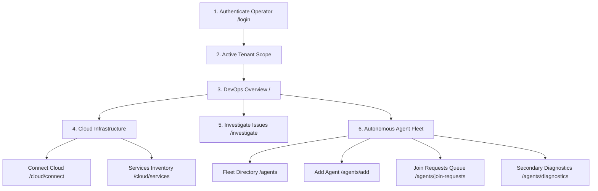
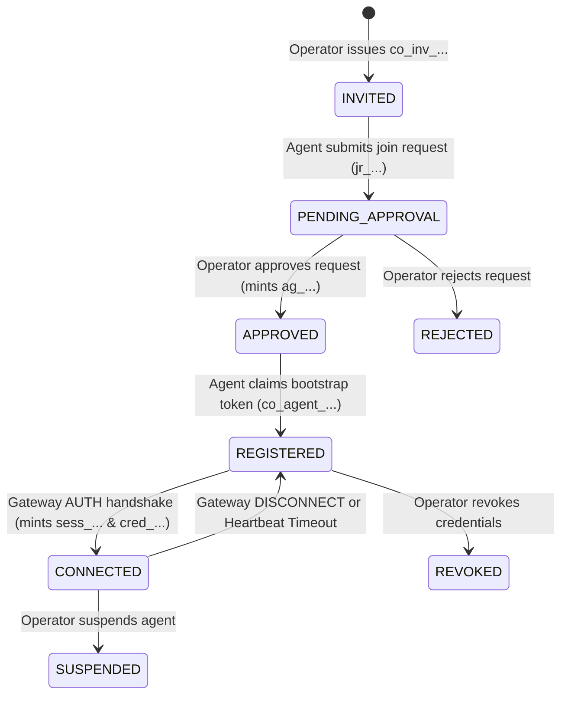

# CloudOps — UI Architecture & Product Console Specification

> **Status:** Specification Updated — Awaiting Approval  
> **Author:** Principal Engineer / UI Architect  
> **Target Product:** CloudOps Autonomous AI Cloud Operations Control Plane  
> **Authoritative Design Spec:** [`skills/railway_ui.md`](file:///Users/user/Desktop/cloud_ops/skills/railway_ui.md)  
> **Scope:** Complete Frontend Information Architecture, Component System, State Machines, Route Contracts, and API Dependencies.

---

## 1. UI Philosophy

CloudOps is an **autonomous AI multi-cloud operations control plane**. It is not a generic consumer dashboard, a chat playground, an IDE, or an unconstrained observability tool. 

The user operating CloudOps is an **infrastructure operator, cloud security officer, or platform engineer** who bears ultimate organizational responsibility for high-stakes cloud mutations (AWS, GCP, Azure, Kubernetes, databases). The UI must instill **absolute trust, operational clarity, cryptographic soberness, and precise control**.

### Core Tenets

1. **Restraint Over Decoration:** High-stakes infrastructure decisions demand high legibility, strict contrast, and clean layout geometry rather than frivolous visual noise, neon glow, or excessive animation.
2. **Operational Reality Over Assumptions:** The UI never fakes state. If an agent is approved, it is displayed strictly as `APPROVED`, never as `CONNECTED`. If an API does not exist, the UI does not invent mock data.
3. **Intent vs. Authority Separation:** Agents reason, plan, and propose operations; CloudOps governs identity, enforces policy, gathers human authorization, and dispenses time-limited, audited credentials. The UI visualizes this boundary at every stage.
4. **Resilient Degradation:** Realtime WebSocket streams enhance the UI, but the UI must never lock up or become unusable when WebSockets disconnect. REST is the ground truth; WebSockets provide acceleration.
5. **Zero Plaintext Secret Exposure:** Authentication material (`co_inv_...`, `co_agent_...`, `cred_...`, session keys, cloud STS tokens) is never casually displayed, cached in local storage, or retained in history. Any necessary one-time display is explicitly acknowledged and guarded.

---

## 2. Design-System Interpretation (`railway_ui.md`)

The authoritative visual specification for CloudOps is defined in [`skills/railway_ui.md`](file:///Users/user/Desktop/cloud_ops/skills/railway_ui.md). This specification prescribes a bespoke, highly restrained editorial design language originally crafted for high-stakes, trust-critical platforms.

### Architectural Mapping

| Token Class | Value / Token | Semantic Role in CloudOps Console |
| :--- | :--- | :--- |
| **Top Navigation & Shell** | `#0f0e0d` (`near-black-ink`) | Persistent top navigation bar, command menu surface, and primary CTA fill. Gives the shell gravitas and authority. |
| **Primary Surface** | `#fafaf9` (`ivory-surface`) | Main background for operational consoles, data views, and content workflows. Reduces cognitive fatigue during prolonged operational shifts. |
| **Card / Surface Elevated** | `#ffffff` (`pure-white`) | Work surfaces, data tables, parameter panels, and inspect drawers. Provides clear layered elevation via surface contrast. |
| **Text Primary** | `#0f0e0d` (`near-black-ink`) | Primary operational copy, headings, agent names, and active values. High-contrast readability. |
| **Text Secondary / Muted**| `#706d66` / `#8f8b85` | Metadata, timestamps, protocol labels, and helper descriptions. |
| **Borders & Dividers** | `#cccac6` (`warm-gray-border`) | Table row lines, panel outlines, input borders, and structural framing. |
| **Interactive Secondary** | `#33312c` (`dark-warm-gray`) | Secondary buttons, border accents, and active state indicators. |
| **Typography: Serif** | `HarveySerifFont`, serif | Page hero headlines (72px), section titles (32px/48px), and modal headers. Imparts institutional authority to control-plane actions. |
| **Typography: Sans** | `HarveySansFont`, Inter, sans-serif | Data tables, form controls, navigation tabs, buttons, and status labels. Engineered for high-density legibility. |
| **Typography: Mono** | `JetBrains Mono`, monospace | Machine identifiers (`ag_...`, `sess_...`, `jr_...`), hash digests, payloads, and WebSocket frames. |
| **Spacing Rhythm** | 8px Base (`base-4`, `xs: 8px`, `sm: 16px`, `base-24: 24px`, `md: 32px`, `base-64: 64px`) | Consistent spatial cadence across cards, forms, tables, and views. |
| **Radii** | `sm: 4px`, `md: 8px`, `form-input: 4px` | Strict, restrained geometry with zero exaggerated roundness. |

### Color Discipline

The palette is deliberately **monochromatic**, signaling disciplined governance. Operational indicators (such as agent lifecycle states) use restrained status indicators:
- **Connected / Ready:** High-contrast solid dark indicator `#0f0e0d` with crisp dot or restrained `#2d6a4f` subtle border.
- **Pending / Action Required:** Restrained `#b45309` indicator for operator review.
- **Revoked / Disconnected / Error:** Restrained `#991b1b` indicator.

## 3. Core Product Mental Model & Information Architecture

CloudOps is designed around the actual target user: a **DevOps / Cloud Operations engineer**, not a backend developer or platform engineer.

The primary user question is:
> **"What infrastructure do I have, what is happening, what needs investigation, and which agents are operating it?"**
NOT:
> *"What is my gateway node, WebSocket session, protocol frame, credential record, or database state?"*



### Navigational Hierarchy & Functional Status

| Section | Route | Classification | Primary DevOps Purpose |
| :--- | :--- | :--- | :--- |
| **Authentication** | `/login` | **IMPLEMENTED** | Operator authentication boundary: validates persona & tenant scope via `AuthAdapter`. |
| **Overview** | `/` | **IMPLEMENTED** | DevOps home: connected clouds, services discovered, unhealthy alerts, active operational agents, recent activity. |
| **Cloud / Connect** | `/cloud/connect` | **IMPLEMENTED (HONEST EMPTY STATE)** | Cloud provider onboarding portal (AWS, GCP, Azure). Clean boundary awaiting Phase 4 cloud adapters. |
| **Cloud / Services** | `/cloud/services` | **IMPLEMENTED (HONEST EMPTY STATE)** | Multi-cloud resource & service catalog. Displays truthful state until cloud discovery lands. |
| **Investigate** | `/investigate` | **IMPLEMENTED (HONEST EMPTY STATE)** | Root-cause analysis console for service anomalies, elevated error rates, and autonomous diagnoses. |
| **Agents / Fleet** | `/agents` | **IMPLEMENTED** | Operator fleet directory: agent name, operational status, runtime, and responsibilities. |
| **Agent Detail** | `/agents/:agentId` | **IMPLEMENTED** | Agent Dossier: "What is it allowed to do, what is it doing, is it healthy?". |
| **Agents / Add Agent** | `/agents/add` | **IMPLEMENTED** | 6-step onboarding workflow, invitation generation, and verification test harness. |
| **Agents / Join Requests** | `/agents/join-requests` | **IMPLEMENTED** | Review queue for prospective agents; capability checklist and approval gate. |
| **Join Request Detail** | `/agents/join-requests/:id` | **IMPLEMENTED** | Detailed capability review & approval/rejection gate. |
| **Agents / Diagnostics** | `/agents/diagnostics` | **IMPLEMENTED (SECONDARY)** | Secondary diagnostics view: WebSocket protocol frame inspector and socket telemetry. |
| **Operations** | `/operations` | **SHELL** | Autonomous cloud operations and multi-turn runs. |
| **Approvals** | `/approvals` | **SHELL** | High-stakes operational action approvals queue. |
| **Policies** | `/policies` | **SHELL** | Declarative governance rules and evaluation modes. |
| **Audit Log** | `/audit` | **SHELL** | Immutable append-only operational audit trail. |
| **Settings** | `/settings` | **SHELL** | Tenant organization profiles and operator keys. |

---

## 4. Primary DevOps Navigation Structure

```text
CloudOps
├── Overview (/)
├── Cloud
│   ├── Connect Cloud (/cloud/connect)
│   └── Services (/cloud/services)
├── Investigate (/investigate)
└── Agents
    ├── Fleet Directory (/agents)
    ├── + Add Agent (/agents/add)
    ├── Join Requests (/agents/join-requests)
    └── Diagnostics (/agents/diagnostics) [Secondary]

Future Extensions:
├── Operations (/operations)
├── Approvals (/approvals)
├── Policies (/policies)
├── Audit (/audit)
└── Settings (/settings)
```

---

## 5. Route Map & Contracts

```text
/login                               IMPLEMENTED — AuthAdapter & OperatorContext
/                                    IMPLEMENTED — DevOps Overview
/cloud/connect                       IMPLEMENTED — Cloud Connection Portal (Honest empty state)
/cloud/services                      IMPLEMENTED — Services Inventory (Honest empty state)
/investigate                         IMPLEMENTED — Incident Resolution Console (Honest empty state)
/agents                              IMPLEMENTED — Operator Fleet Directory
/agents/:agentId                     IMPLEMENTED — Operator Agent Dossier
/agents/add                          IMPLEMENTED — 6-Step Agent Onboarding Workflow
/agents/join-requests                IMPLEMENTED — Agent Join Requests Review Queue
/agents/join-requests/:requestId     IMPLEMENTED — Capability Review & Approval Gate
/agents/diagnostics                  IMPLEMENTED — Secondary WebSocket & Protocol Diagnostics

Compatibility Redirects:
/onboarding                          REDIRECTS TO /agents/add
/onboarding/requests/:requestId      REDIRECTS TO /agents/join-requests/:requestId
/runtime                             REDIRECTS TO /agents/diagnostics
```

---

## 6. Page-by-Page Specification

### 6.1 Authentication Experience (`/login`)
* **Purpose:** Entry boundary into the CloudOps control plane. Authenticates operator identity, initializes `OperatorContext`, selects active tenant organization, and guards all downstream operational surfaces.
* **Layout:** Centered security card on `#fafaf9` ivory surface framed by a warm `#0f0e0d` header badge. Editorial headline in `HarveySerifFont` ("Authenticate Operator Session").
* **Sections:**
  1. *Header & Branding:* CloudOps Control Plane insignia, authority title, and security advisory.
  2. *Operator Identity Selector:* Allows selection of active operator persona (e.g. `op_admin_operator` — Primary Cloud Operations Administrator) without exposing backend raw header semantics (`x-operator-id`).
  3. *Tenant Organization Scope:* Allows selection of active organizational tenant (e.g. `ten_default_tenant` — Primary Development Tenant) without exposing raw header semantics (`x-tenant-id`).
  4. *Session Duration Indicator:* Standard operational session TTL (8 hours / single shift).
  5. *Primary Action Button:* Solid dark fill (`#0f0e0d`) "Authenticate & Enter Control Plane →".
* **Architecture & Abstraction:**
  - Implemented via a pluggable `AuthAdapter` (`IAuthAdapter`) interface.
  - The current implementation uses `DevAuthAdapter` which validates against known tenant/operator contexts and initializes an in-memory `OperatorContext`.
  - **No Plaintext Secret Persistence:** Secrets or bearer tokens are **never** stored in Local Storage. Session state is held in an in-memory React Context with lightweight session-cookie compatibility, preserving a direct upgrade path to future HttpOnly cookie / OIDC flows.
* **States:**
  - *Loading:* Monochromatic disabled button with "Authenticating Session...".
  - *Error:* Clear alert banner if tenant or operator context cannot be validated.
  - *Success:* Redirect to `/` (or originally requested deep-link URL).

### 6.2 Overview (`/`)
* **Purpose:** Answer the fundamental operational question: *"What is the state of my autonomous cloud control plane right now?"*
* **Layout:** Top editorial banner with 72px `HarveySerifFont` headline, followed by 4-column metric grid on `#ffffff` cards, real-time control plane health panels, and immutable invariant status.
* **Sections:**
  1. *Hero Headline:* Editorial statement establishing control plane authority.
  2. *System Health Strip:* Fastify REST engine status, PostgreSQL 16 connection state, WebSocket Gateway liveness.
  3. *Fleet Metrics:* Total Registered Agents, Live Connected Sessions, Pending Onboarding Join Requests, Suspended Agents.
  4. *Invariant Matrix:* Visual representation of non-negotiable guarantees: `APPROVED ≠ CONNECTED`, Single-Use Replay Protection, Zero Plaintext Secrets, Intent vs. Authority.
  5. *Quick Action Panel:* 1-click navigation to Onboard Agent, Inspect Fleet, or Open Runtime Inspector.
* **API Dependencies:** `GET /healthz`, `GET /readyz`, `GET /v1/agents`, `GET /v1/agent-join-requests`.
* **States:**
  - *Loading:* Monochromatic skeleton placeholders.
  - *Error:* Banner highlighting specific unreachable component (e.g. Database unreachable 503).
  - *Empty:* Guided onboarding card prompting the operator to create their first agent invite.

### 6.3 Agent Fleet Directory (`/agents`)
* **Purpose:** Comprehensive fleet management view of all registered agents across their full lifecycle.
* **Layout:** Filter and search toolbar at top, followed by a high-density, cleanly structured data table on `#ffffff` with warm gray dividers (`#cccac6`).
* **Sections:**
  1. *Filter Bar:* Filter by Lifecycle Status (`ALL`, `CONNECTED`, `REGISTERED`, `APPROVED`, `SUSPENDED`, `REVOKED`), search by Agent Name / Agent ID.
  2. *Fleet Table:*
     - Columns: `Agent ID` (`ag_...`), `Name`, `Framework/Type` (`hermes`, `openclaw`, `custom`), `Version`, `Protocol`, `Status Pill`, `Created At`, `Actions`.
  3. *Batch / Action Context:* Quick link to Onboard Agent or jump to Runtime Sessions.
* **API Dependencies:** `GET /v1/agents`.
* **States:**
  - *Loading:* Table row skeletons.
  - *Empty:* Clean empty state with copy: "No agents found matching filter. Onboard an agent to start."
  - *Error:* Actionable message with retry button.

### 6.4 Agent Detail Dossier (`/agents/:agentId`)
* **Purpose:** Comprehensive operational dossier for a single agent identity.
* **Layout:** Split header (Identity + Status) with multi-tab layout: `Overview & Connectivity`, `Capabilities`, `Credentials Metadata`, `Audit Activity`.
* **Sections:**
  1. *Header:* Agent Name, `ag_...` ID with 1-click copy, framework badge, runtime version, and current lifecycle state pill.
  2. *Connectivity Panel:* Current connection status. If `CONNECTED`, shows active session ID (`sess_...`), gateway node, connected duration, and heartbeat freshness. If `REGISTERED`, shows "Disconnected — Ready for authenticated Gateway handshake".
  3. *Capabilities Panel:* Strictly divides:
     - **Declared Capabilities:** Parsed from original join request (e.g. `aws.ecs.describe_clusters`).
     - **Authorized Capabilities:** Formally granted by CloudOps governance (defaults to empty until Phase 5).
  4. *Credential Metadata:* Lists active and rotated credentials (`cred_...`), issue timestamps, expiration, and rotation parentage. **Never displays secret hashes or values.**
* **API Dependencies:** `GET /v1/agents/:id`.
* **Actions:** View Gateway handshake connection snippet, copy agent identity.

### 6.5 Onboarding Console (`/onboarding`)
* **Purpose:** Issue high-entropy cryptographic invitations, test the onboarding pipeline, and inspect the join request queue.
* **Layout:** Two-column workspace: Left column for invite generation & token inspection; Right column for interactive agent simulation test harness. Full-width table below for pending join requests.
* **Sections:**
  1. *Create Invite Card:* Select lifetime (1h, 24h, 3d, 7d), generate `co_inv_...` token. Highlights that raw token is returned once and stored as a SHA-256 hash.
  2. *Active Token Display:* High-contrast code box with expiration timestamp, copy button, and manifest URL reference.
  3. *Agent Simulator Harness:* Allows operators to immediately simulate how an autonomous agent (`hermes` or `openclaw`) fetches the manifest and submits declarative join requests with requested capabilities.
  4. *Join Request Queue:* Table of join requests for the active tenant, showing declared capabilities and pending status.
* **API Dependencies:** `POST /v1/agent-invites`, `GET /v1/agent-join-requests`, `GET /v1/onboarding/:token`, `POST /v1/onboarding/:token/join`.

### 6.6 Join Request Review & Approval (`/onboarding/requests/:requestId` or Slide-Over Drawer)
* **Purpose:** The security gating checkpoint where an operator verifies declarative agent metadata before granting identity.
* **Layout:** Centered security review card or full slide-over panel with clear risk indicators.
* **Sections:**
  1. *Agent Declaration Summary:* Proposed Agent Name, Agent Framework Type, Version, Runtime Endpoint.
  2. *Requested Capabilities Matrix:* Clear breakdown of every cloud action the agent has requested to execute.
  3. *Security Advisory Banner:* Explicitly reminds the operator that approving this request mints stable identity `ag_...` and authorizes the agent to claim a one-time bootstrap token, but **does not** grant runtime connection.
  4. *Operator Actions:*
     - **Approve:** Executes `POST /v1/agent-join-requests/:id/approve`.
     - **Reject:** Prompts for mandatory rejection reason and executes `POST /v1/agent-join-requests/:id/reject`.
* **API Dependencies:** `POST /v1/agent-join-requests/:id/approve`, `POST /v1/agent-join-requests/:id/reject`.

### 6.7 Runtime Gateway Console (`/runtime`)
* **Purpose:** Dedicated operational window into Phase 3 authenticated WebSocket connectivity, active sessions, and protocol health.
* **Layout:** Top metrics (Active Sessions, Total Authenticated Frames, Heartbeat Compliance), followed by an interactive WebSocket session inspector and handshake simulator.
* **Sections:**
  1. *Gateway Telemetry:* Port 3000 WebSocket status, heartbeat interval (30s), stale timeout threshold (90s).
  2. *Active Runtime Sessions Table:* Agent ID, Session ID (`sess_...`), Connected Timestamp, Last Heartbeat, Disconnect Reason (if terminated).
  3. *Interactive Gateway Terminal:* Live client that connects directly to `ws://localhost:3000/v1/gateway/ws` to demonstrate `AUTH` (BOOTSTRAP vs RUNTIME), `HEARTBEAT`, `ROTATE_CREDENTIAL`, and `DISCONNECT` frames with JSON payload inspection.
* **API Dependencies:** `GET /v1/agents`, `WS /v1/gateway/ws`.

### 6.8 Shell Pages (`/operations`, `/approvals`, `/capabilities`, `/policies`, `/audit`, `/settings`)
* **Purpose:** Establish the complete product structure without fabricating fake operational data.
* **Layout:** Follows standard `#0f0e0d` header and `#fafaf9` ivory body with an authoritative banner explaining the exact phase dependency and architectural contract.
* **Sections:**
  1. *Phase & Contract Badge:* e.g. "Phase 5 Governance Contract".
  2. *Architectural Guarantee Description:* Explains what the engine will enforce when the backend phase activates (e.g., in `/approvals`: Operation-bound human approvals cryptographically anchored to SHA-256 payload digests).
  3. *Database Schema Reference:* References the existing migration tables already provisioned in PostgreSQL (`approvals`, `capabilities`, `policies`, `runs`, `tool_executions`).
  4. *Empty State / Coming in Phase N:* Clear, professional placeholder communicating roadmap maturity.

---

## 7. Component Architecture

All UI components adhere strictly to the tokens and guidelines defined in `skills/railway_ui.md`:

```text
apps/web/src/
├── auth/
│   ├── AuthAdapter.ts            # Pluggable authentication interface (IAuthAdapter, DevAuthAdapter)
│   ├── OperatorContext.tsx       # React Context providing active operator, tenant, and session
│   ├── AuthGuard.tsx             # Route wrapper redirecting unauthenticated users to /login
│   └── LoginForm.tsx             # Operator authentication card adhering to Harvey/Railway aesthetic
├── components/
│   ├── shell/
│   │   ├── AppShell.tsx          # Master layout container with dark top nav and ivory body
│   │   ├── TopNav.tsx            # #0f0e0d navigation bar with brand, links, and status
│   │   ├── TenantSwitcher.tsx    # Tenant selector component with current scope indicator
│   │   ├── OperatorBadge.tsx     # Active operator session badge & logout trigger
│   │   └── Footer.tsx            # Restrained footer with version and invariant reminders
│   ├── common/
│   │   ├── Card.tsx              # #ffffff card with #cccac6 border and surface contrast
│   │   ├── Button.tsx            # Primary (dark #0f0e0d), Secondary (#fafaf9 / #cccac6), Danger
│   │   ├── StatusPill.tsx        # High-legibility status pill for agent and request states
│   │   ├── CodeBox.tsx           # Monospace snippet box with 1-click copy
│   │   ├── Table.tsx             # Clean data table with warm gray dividers
│   │   ├── Banner.tsx            # Informational / Advisory / Error banner
│   │   ├── Drawer.tsx            # Slide-over inspection drawer for details & reviews
│   │   └── Modal.tsx             # Confirmation dialog for destructive operations
│   ├── agents/
│   │   ├── AgentTable.tsx        # Sortable, filterable agent fleet table
│   │   ├── AgentStatusBadge.tsx  # Lifecycle state indicator (APPROVED, REGISTERED, CONNECTED)
│   │   └── AgentDossier.tsx      # Full-screen or tabbed agent detail panel
│   ├── onboarding/
│   │   ├── InviteGenerator.tsx   # Form to generate high-entropy co_inv_... tokens
│   │   ├── AgentSimulator.tsx    # In-browser testing simulator for agent onboarding
│   │   ├── JoinRequestTable.tsx  # Operator review table for join requests
│   │   └── JoinRequestReview.tsx # Capability inspection & approve/reject dialog
│   └── runtime/
│       ├── GatewayStatusCard.tsx # WebSocket status & heartbeat metrics
│       ├── SessionTable.tsx      # Active and historical agent sessions
│       └── FrameInspector.tsx    # Live WebSocket frame viewer and debugger
```

---

## 8. Authentication Model

### Architectural Design: The `AuthAdapter` Pattern

To build a complete operator-facing authentication experience today without pretending that an un-built OIDC/SSO server exists, CloudOps introduces an **`AuthAdapter` abstraction layer**:

```typescript
export interface OperatorSession {
  operatorId: string;
  operatorName: string;
  operatorRole: "admin" | "security_officer" | "platform_engineer" | "auditor";
  tenantId: string;
  tenantName: string;
  authenticatedAt: string;
  expiresAt: string;
}

export interface IAuthAdapter {
  authenticate(credentials: { operatorId?: string; tenantId?: string }): Promise<OperatorSession>;
  getCurrentSession(): Promise<OperatorSession | null>;
  logout(): Promise<void>;
  getAvailableTenants(): Promise<Array<{ id: string; name: string }>>;
  getAvailableOperators(): Promise<Array<{ id: string; name: string; role: string }>>;
}
```

### Development Auth Adapter (`DevAuthAdapter`)

The `DevAuthAdapter` grounds itself truthfully in the current repository:
1. **Persona & Scope Resolution:** Resolves available tenants (seeded `ten_default_tenant`) and known operator personas (`op_admin_operator`).
2. **Encapsulated Headers:** The API client automatically attaches `x-tenant-id` and `x-operator-id` to outgoing REST requests using the session resolved by `DevAuthAdapter`. **These raw header keys are never exposed as user-facing form inputs.**
3. **Storage Security Rule:** No secrets, passwords, or bearer tokens are saved in browser `localStorage`. Operator session state resides in React Context with memory persistence and optional session cookies.
4. **Future SSO/OIDC Transition:** When production OIDC / IAM lands in a later phase, `DevAuthAdapter` is replaced with `OidcAuthAdapter` (redirecting to enterprise IdP and exchanging an HttpOnly session cookie). **Zero pages or components in the operational UI will need to be refactored.**

---

## 9. Tenant Isolation Model

CloudOps enforces strict multi-tenancy at every tier:
1. **Visual Clarity:** The active tenant is displayed prominently in the top bar (`ten_default_tenant`).
2. **Data Boundaries:** Every data fetch (`fetchAgents`, `fetchJoinRequests`, `createInvite`) is tenant-isolated.
3. **Switching Mechanism:** When the operator selects another tenant from the dropdown, all fleet tables, join requests, and metrics automatically re-fetch with the new tenant scope.
4. **Foreign Key Integrity:** Invites and agent registrations cannot be created for non-existent tenants. The UI handles any tenant mismatch cleanly with a `TenantNotFoundError` banner rather than a crash.

---

## 10. Agent Lifecycle State Mapping

The UI strictly models the lifecycle state machine defined across Phases 1, 2, and 3:



### UI Display Guidelines

| Lifecycle State | Display Pill | Color & Style | Semantic Meaning in UI |
| :--- | :--- | :--- | :--- |
| **`INVITED`** | `INVITED` | Gray hollow border | Invitation generated; no agent has claimed or submitted a join request yet. |
| **`PENDING_APPROVAL`** | `PENDING` | Amber text, warm gray background | Agent submitted join request; awaiting operator review of declared capabilities. |
| **`APPROVED`** | `APPROVED` | Dark warm gray pill | Operator approved identity (`ag_...`); **not yet connected**. Bootstrap token ready to claim. |
| **`REGISTERED`** | `REGISTERED` | Solid dark badge | Agent claimed bootstrap credential; ready for Gateway authentication. Offline. |
| **`CONNECTED`** | `CONNECTED` | Dark ink badge with active pulse | Live authenticated WebSocket session active. Heartbeats within 30s window. |
| **`DISCONNECTED`** | `OFFLINE` | Muted gray | Previously connected session closed cleanly or timed out. Identity remains registered. |
| **`REJECTED`** | `REJECTED` | Muted red border | Join request rejected by operator. Reason displayed in review history. |
| **`SUSPENDED`** | `SUSPENDED` | Warning amber border | Operator administratively suspended agent operations. |
| **`REVOKED`** | `REVOKED` | Danger red border | Cryptographic credentials revoked. Agent cannot authenticate. |

---

## 11. Capability State Mapping

To ensure security invariants are never blurred, the UI maintains a strict visual separation between **Declared Capabilities** and **Authorized Capabilities**:

```text
┌───────────────────────────────────────────────────────────────┐
│ CAPABILITY BOUNDARY INSPECTOR                                 │
├───────────────────────────────┬───────────────────────────────┤
│ DECLARED CAPABILITIES         │ AUTHORIZED CAPABILITIES       │
│ (Claimed by Agent Manifest)   │ (Granted by CloudOps Policy)  │
├───────────────────────────────┼───────────────────────────────┤
│ • aws.ecs.describe_clusters   │ • aws.ecs.describe_clusters   │
│ • aws.ecs.list_tasks          │ • aws.ecs.list_tasks          │
│ • aws.ecs.stop_task [DANGER]  │ ── NOT AUTHORIZED ──          │
└───────────────────────────────┴───────────────────────────────┘
```

- **Declared Capabilities:** What the agent code reports it wants to do upon joining. Displayed in plain monospace.
- **Authorized Capabilities:** What CloudOps policies formally permit the agent to execute. Displayed with explicit authority checkmarks.
- **Invariant Rule:** `Authorized Capabilities ⊆ Declared Capabilities`. An agent can never execute an action it did not declare, and cannot execute any action without explicit authorization.

---

## 12. Security UX Rules

CloudOps controls high-privilege cloud infrastructure. The UI enforces four non-negotiable security UX rules:

1. **One-Time Secret Visibility:**
   - Raw tokens (`co_inv_...`, `co_agent_...`) are only viewable immediately upon creation.
   - The UI provides a prominent "Copy Token" button with clear advisory: *"This credential will never be displayed again. Store it securely."*
   - Once dismissed, the UI only displays the SHA-256 hash preview (e.g. `e3b0c44...`).
2. **Explicit Confirmation for Destructive Actions:**
   - Approving, rejecting, revoking, or disconnecting an agent requires confirmation showing the exact target Agent ID, Tenant, and consequence.
3. **No Sensitive Telemetry in URLs:**
   - Credentials, claim tokens, and secrets are never passed as URL search params or route segments.
4. **Tamper-Evident Audit Logging:**
   - All operator actions (create invite, approve request, reject request) generate tamper-evident audit log entries in the backend database.

---

## 13. API Mapping

| UI View | Target CloudOps API | Method | Payload / Headers | Purpose & Lifecycle Effect |
| :--- | :--- | :--- | :--- | :--- |
| **Login** | Internal `AuthAdapter` | Call | Persona & Tenant choice | Authenticates operator session; establishes `OperatorContext` |
| **Overview** | `/healthz` | `GET` | None | Verify HTTP server liveness & uptime |
| **Overview** | `/readyz` | `GET` | None | Verify PostgreSQL database connectivity |
| **Overview / Fleet** | `/v1/agents` | `GET` | Bound by `OperatorContext` | Retrieve registered agent fleet |
| **Agent Dossier** | `/v1/agents/:id` | `GET` | Bound by `OperatorContext` | Retrieve single agent record & status |
| **Onboarding** | `/v1/agent-invites` | `POST` | `{ expiresInSeconds }` | Mint onboarding invite token (`co_inv_...`) |
| **Onboarding** | `/v1/agent-join-requests` | `GET` | `?status=...` | List join requests for review |
| **Review Drawer** | `/v1/agent-join-requests/:id/approve` | `POST` | Bound by `OperatorContext` | Mint stable identity `ag_...`; status $\to$ `APPROVED` |
| **Review Drawer** | `/v1/agent-join-requests/:id/reject` | `POST` | `{ reason }` | Reject join request; status $\to$ `REJECTED` |
| **Simulator** | `/v1/onboarding/:token` | `GET` | None | Resolve agent onboarding manifest |
| **Simulator** | `/v1/onboarding/:token/join` | `POST` | `{ agent, runtime, requestedCapabilities }` | Submit declarative join request |
| **Simulator** | `/v1/onboarding/claim` | `POST` | `{ inviteToken, joinRequestId }` | Atomically claim bootstrap token (`co_agent_...`) |
| **Runtime Console**| `/v1/gateway/ws` | `WS` | Frame: `AUTH` | Establish live session; transition to `CONNECTED` |
| **Runtime Console**| `/v1/gateway/ws` | `WS` | Frame: `HEARTBEAT` | Maintain session liveness (30s interval) |
| **Runtime Console**| `/v1/gateway/ws` | `WS` | Frame: `ROTATE_CREDENTIAL` | Execute atomic runtime credential rotation |
| **Runtime Console**| `/v1/gateway/ws` | `WS` | Frame: `DISCONNECT` | Close session; reset agent status to `REGISTERED` |

---

## 14. Frontend Implementation Phases

To deliver a production-grade UI without breaking existing verified functionality, we propose the following sequential execution plan:

### Phase A: Design System Tokens, AuthAdapter & Global Shell
- Implement the exact design tokens from `railway_ui.md` in CSS variables (`globals.css`):
  - `#0f0e0d` for top nav and primary CTAs.
  - `#fafaf9` for main ivory background.
  - `#ffffff` for cards and panels.
  - `#cccac6` for warm gray borders.
  - Typography configuration for `HarveySerifFont` / serif headlines and `HarveySansFont` / sans body copy.
  - 8px spatial grid and restrained 4px/8px radii.
- Implement the **Authentication Foundation**:
  - `AuthAdapter` abstraction and `DevAuthAdapter`.
  - `OperatorContext` provider and session guard (`AuthGuard`).
  - `/login` page for operator persona selection and tenant scoping.
- Construct the core layout shell (`AppShell`, `TopNav`, `Footer`, `TenantSwitcher`).

### Phase B: Primary Operational Pages (IMPLEMENT NOW)
- Build the **Overview** page (`/`): Real-time health, fleet telemetry cards, architectural invariant matrix.
- Build the **Agent Fleet Directory** (`/agents`): High-density data table, search, status filters (`CONNECTED`, `REGISTERED`, `APPROVED`).
- Build the **Agent Dossier** (`/agents/:agentId`): Detailed identity, connection status, declared vs. authorized capabilities, credential metadata.
- Upgrade the **Onboarding Console** (`/onboarding`): Clean two-column workflow for invite token generation, active token card, agent simulator harness, and join request approval/rejection pipeline.
- Build the **Runtime Gateway Console** (`/runtime`): Gateway health, session monitor, and interactive WebSocket frame inspector.

### Phase C: Architectural Shells (SHELL)
- Implement structured shell pages for future phases:
  - `/operations`: Explaining cloud execution and tool run boundaries (Phase 6).
  - `/approvals`: Explaining operation-bound human approvals (Phase 5).
  - `/capabilities`: Explaining capability authorization and catalog (Phase 5).
  - `/policies`: Explaining deterministic policy rules (Phase 5).
  - `/audit`: Explaining append-only audit trail and backend dependency.
  - `/settings`: Organization and tenant configuration.
- Each shell page displays the verified architectural contract and database schema reference, without fake metrics.

### Phase D: Quality Verification & End-to-End Walkthrough
- Verify responsive layout across Mobile (`<= 640px`), Tablet (`>= 768px`), and Desktop (`>= 1106px`).
- Run full Next.js static build (`next build`) to ensure 0 TypeScript errors and 0 build warnings.
- Run complete integration test suite (`vitest run`) to guarantee 100% test pass rate and strict non-regression.
