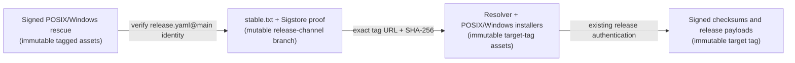

# Authenticated release channel and rescue bootstrap

DefenseClaw keeps every versioned release immutable. A published tag is never
edited to repair an installer or upgrade resolver. Starting with `0.8.8`, each
release instead includes checksummed `defenseclaw-rescue.sh` and
`defenseclaw-rescue.ps1` assets that discover the current resolver or fresh
installer through an authenticated stable channel.

The result is a mutable pointer to immutable code:



This separation lets a later release repair orchestration for older
installations without replacing anything attached to an existing tag. The
channel changes; the referenced resolver and all installable payloads do not.
Use the canonical [DefenseClaw Release Runbook](RELEASE_RUNBOOK.md) to operate
a normal release or channel repair.

## Channel contract

The release workflow publishes four files on the dedicated
`release-channel` branch:

- `stable.txt`
- `stable.txt.sig`
- `stable.txt.pem`
- `stable.txt.bundle`

`stable.txt` is fixed-order ASCII with exactly these fields:

| Field | Binding |
| --- | --- |
| `schema` | `defenseclaw-release-channel-v1` |
| `channel` | `stable` |
| `repository` | `cisco-ai-defense/defenseclaw` |
| `target_version` | Canonical `X.Y.Z` |
| `target_tag` | Exactly equal to `target_version` |
| `target_ref` | Exactly `refs/tags/<target_version>` |
| `target_commit` | Lowercase 40-character commit ID |
| `resolver_name` | Exactly `defenseclaw-upgrade.sh` |
| `resolver_url` | Derived exactly from repository, tag, and resolver name |
| `resolver_sha256` | Digest copied from the immutable release's signed `checksums.txt` |
| `posix_installer_name` | Exactly `install.sh` |
| `posix_installer_url` | Derived exactly from repository, tag, and POSIX installer name |
| `posix_installer_sha256` | Digest copied from the immutable release's signed `checksums.txt` |
| `windows_installer_name` | Exactly `install.ps1` |
| `windows_installer_url` | Derived exactly from repository, tag, and Windows installer name |
| `windows_installer_sha256` | Digest copied from the immutable release's signed `checksums.txt` |

The document is not shell code and is never sourced or evaluated. Its
fixed-order line format lets the rescue bootstrap parse it without depending
on a working DefenseClaw Python environment, `python3`, or `jq`.

## Publication order

The release workflow advances the channel only after all of the following are
true:

1. The exact tested release candidate has been published under its version
   tag.
2. GitHub reports that release as immutable and every remote asset digest
   matches the sealed candidate.
3. The channel candidate is generated from that candidate's
   `checksums.txt`.
4. Cosign signs the channel with the keyless identity
   `https://github.com/cisco-ai-defense/defenseclaw/.github/workflows/release.yaml@refs/heads/main`.
5. The workflow verifies its own signature and authenticates the existing
   channel when it is valid.
6. Normal publication requires the existing channel to be identical (an
   idempotent rerun) or older. Explicit repair may replace an invalid tip only
   after proving the target is the newest immutable stable release.
   Same-version rebinding and version rollback are rejected.
7. The `release-channel` branch is updated with a non-forced, fast-forward Git
   commit, and the workflow reads back and verifies the published bytes.

If channel publication fails after the immutable release was created, the
release remains valid but the stable pointer stays on the previous version.
GitHub's **Re-run failed jobs** action keeps the original workflow commit and
reruns only the separate channel job, which reverifies the tested artifact and
reconciles the already-published exact candidate before safely retrying the
channel advance. After immutable publication, an operator may instead dispatch
`release.yaml` with `operation=repair-channel` and the published version. That
path proves the target is the newest immutable stable release, re-authenticates
its published checksums, provenance, and remote custody, then repairs only the
signed stable pointer; it does not rebuild or replace any release asset. If the
current channel tip is invalid, repair preserves it in history and publishes a
valid child with a non-forced fast-forward update. A normal release dispatch
rejects every already-published version because notarization and platform
signatures are not reproducible custody identities. It accepts only an absent
namespace or an exact same-commit tag with no release, allowing recovery from a
failure that occurred before publication began. Creating either namespace
requires the selected commit to remain reachable from protected `main`.

Both operations use the same simple manual dispatch from `main`: select
`operation=release` or `operation=repair-channel` and enter the bare `X.Y.Z`
version. That action is the operator's authorization. GitHub automatically
freezes the event's exact `github.sha`; no copied commit SHA, repository-setting
confirmation, or local preflight is required.

A `release-channel` branch ruleset is optional hardening. It can reduce
accidental deletion or rewrites and improve the Git audit trail, but it is not
a release prerequisite or client trust boundary; an operator does not need to
create one before release. This relies on protected `main`, its required checks,
and the reviewed release workflow and signing identity remaining protected from
administrator-level bypass. A channel ruleset alone cannot defend against an
administrator who can rewrite those publishing authorities.

With those authorities intact, someone limited to editing the channel can
delete the pointer or replay an older valid signed document, causing
availability or freshness problems. They cannot make clients accept an
unsigned or modified document: clients require the release workflow's Sigstore
identity, then require its SHA-256 bindings to immutable versioned resolver,
installer, and payload assets.

## Rescue behavior

Run `defenseclaw-rescue.sh` only after obtaining it from an authenticated
`0.8.8` or later release (or another trusted distribution of those exact
bytes). A `releases/latest/download` URL is only a locator; authenticate the
bootstrap through that release's signed `checksums.txt` before its first use.
Do not stream a raw branch or release response directly into a shell. Download
the bootstrap to a regular file, verify that saved file, and only then run it.
For example, after selecting an already authenticated release:

```bash
AUTHENTICATED_RELEASE=0.8.8
curl --fail --location --proto '=https' \
  --output ./defenseclaw-rescue.sh \
  "https://github.com/cisco-ai-defense/defenseclaw/releases/download/${AUTHENTICATED_RELEASE}/defenseclaw-rescue.sh"
# Verify ./defenseclaw-rescue.sh against that release's signed checksums.txt.
```

The bootstrap refuses stdin or pipe execution because clean Bash re-execution
must reopen the same saved bytes.

The rescue bootstrap:

1. Resolves the `release-channel` ref once to a canonical commit locator, then
   downloads `stable.txt`, `stable.txt.sig`, `stable.txt.pem`, and
   `stable.txt.bundle` through that same immutable commit. This prevents
   independent branch-path caches from mixing old and new proof generations
   during a channel rotation.
2. Treats an existing Cosign only as a byte source: it copies the binary into
   private custody and executes it only if it matches the platform's pinned
   Cosign `2.6.3` SHA-256. Otherwise it downloads and authenticates those same
   pinned bytes.
3. Verifies the bundle's transparency-log inclusion proof and requires the
   exact `release.yaml@main` Fulcio identity and GitHub Actions OIDC issuer.
4. Validates every channel field and reconstructs the canonical bytes so
   duplicate, reordered, redirected, or extra fields fail closed.
5. Selects only the exact version-tagged resolver or POSIX installer URL
   derived from the authenticated channel.
6. Verifies the selected asset's SHA-256 and Bash syntax, plus the resolver
   completeness marker when recovering an existing installation.
7. Supplies the authenticated channel version as the resolver target or the
   installer's `VERSION`, then passes only compatible operator arguments.

The authenticated target resolver keeps that clean `PATH` boundary. When it
needs `uv`, it always downloads the platform archive for pinned `uv` `0.11.28`,
verifies its reviewed SHA-256, and extracts only the explicit platform
executable into private upgrade custody. It never discovers, copies,
version-probes, or executes a `uv` from `PATH` or a local known location, and it
never streams an upstream installer. The resolver places that authenticated
binary and the already verified installed gateway directory first on `PATH`
only for the immutable `0.8.5` controller children that still discover those
tools by name. It retains only the private `uv` between the hard-cut and final
child, then the existing resolver exit cleanup removes it.

Interrupted phase-two recovery uses the same authenticated uv bootstrap before
it can reinstall the retained bridge wheel. That recovery therefore requires
network access to the pinned upstream archive; a coincidentally cached local
`uv` no longer creates an undocumented offline recovery path.

The target resolver also owns the narrow field compatibility rule for
cursorless `0.8.6` and `0.8.7` installations. This is deliberately a
same-user repair rule, not an attempt to authenticate every byte of the
installed source. It requires matching CLI and gateway versions, the known
public integer config-v8 boundary, a wholly absent migration cursor, and no
active or incomplete upgrade transaction. A partial cursor, mixed component
version, invalid config-version boundary, or upgrade residue still fails before
service or installed-state mutation. The resolver then relies on its existing
backup and rollback transaction while authenticating every downloaded target
artifact through the signed release contract and requiring final
version-bound health.

The bootstrap rejects an operator-supplied `--version` and
`--allow-unverified`; neither command-line nor ambient legacy overrides may
replace the signed stable target or bypass its authentication.

For the two field-recovery cases:

```bash
# Recover a supported 0.8.6 or 0.8.7 public first-run state whose cursor is absent.
/bin/sh ./defenseclaw-rescue.sh --yes

# Preserve a proven-corrupt audit SQLite tuple and activate a fresh store.
/bin/sh ./defenseclaw-rescue.sh --yes --recover-corrupt-audit
```

For a fresh macOS or Linux host, the same authenticated bootstrap can select
the immutable POSIX installer bound by the channel:

```bash
/bin/sh ./defenseclaw-rescue.sh --install --yes --connector none
```

`--install` is fresh-install-only. It rejects upgrade recovery options,
version or verification overrides, and `--local`, then executes the exact
checksummed `install.sh` asset with the channel's authenticated version.
Native Windows x64 clients use the immutable `defenseclaw-rescue.ps1` asset.
It verifies the same fixed 16-field signed channel, downloads the separately
bound immutable `install.ps1`, checks its digest and PowerShell syntax, and
passes the authenticated channel version to that installer. See
[`WINDOWS_RESCUE.md`](WINDOWS_RESCUE.md).

The bootstrap itself does not directly stop services or mutate installed
state. Recovery preflight, backup, custody, bridge selection, rollback, and
health checks remain owned by the authenticated target resolver; fresh
installation remains owned by the authenticated target installer.

## Trust and failure boundaries

- A mutable channel is not permission to mutate tagged artifacts. Resolver
  and installer bytes are fetched from an exact version tag and must match
  their signed channel digests.
- TLS is transport protection, not artifact authentication. The Sigstore
  workflow identity authenticates the channel; SHA-256 then binds the tagged
  resolver.
- The unsigned channel-ref commit is only a consistency and availability
  locator. Clients retry a bounded number of snapshots, but accept a snapshot
  only when its exact manifest and proof authenticate under the release
  workflow identity.
- Cosign verification runs with private HOME/XDG roots and without ambient
  Sigstore/TUF trust overrides. Resolver syntax and execution use a validated
  root-owned system Bash with shell hooks, exported functions, and loader
  injection variables removed.
- An unsigned channel edit, arbitrary URL, changed resolver or installer name,
  tag/ref mismatch, same-version digest change, or rollback publication is
  rejected.
- While protected `main`, required checks, and the release workflow/signing
  identity remain intact, someone limited to editing the channel could delete
  it or replay an older, previously valid signed document. That is a
  freshness/availability risk, not authority to execute modified bytes: the
  resolver is still an immutable signed release asset, and normal upgrade
  policy refuses downgrades. An administrator able to bypass or rewrite those
  publishing authorities can change the trusted publisher regardless of a
  channel ruleset.
- Windows rescue delegates to native Setup and its signed release contract;
  it supports native Windows x64 only. macOS and Linux use the POSIX rescue.
